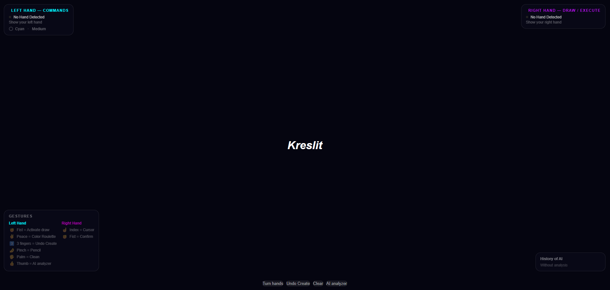
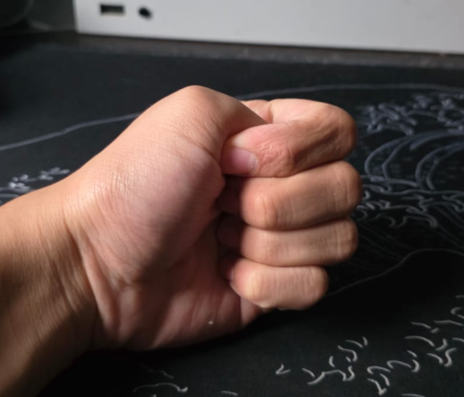
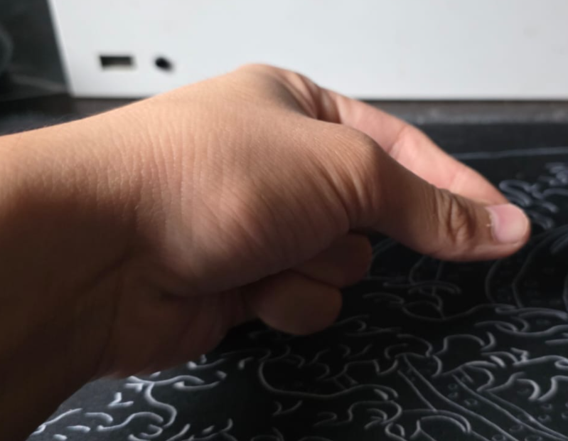
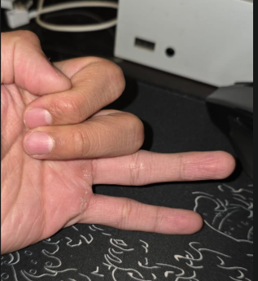
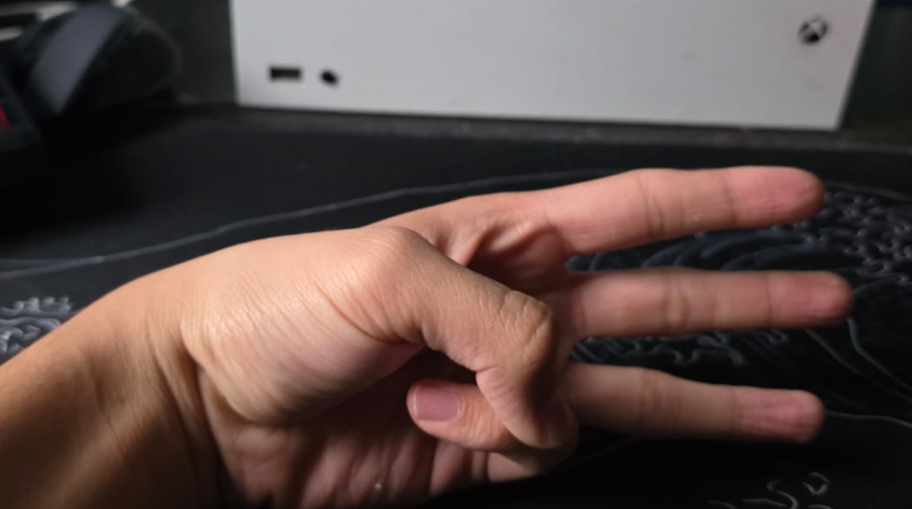
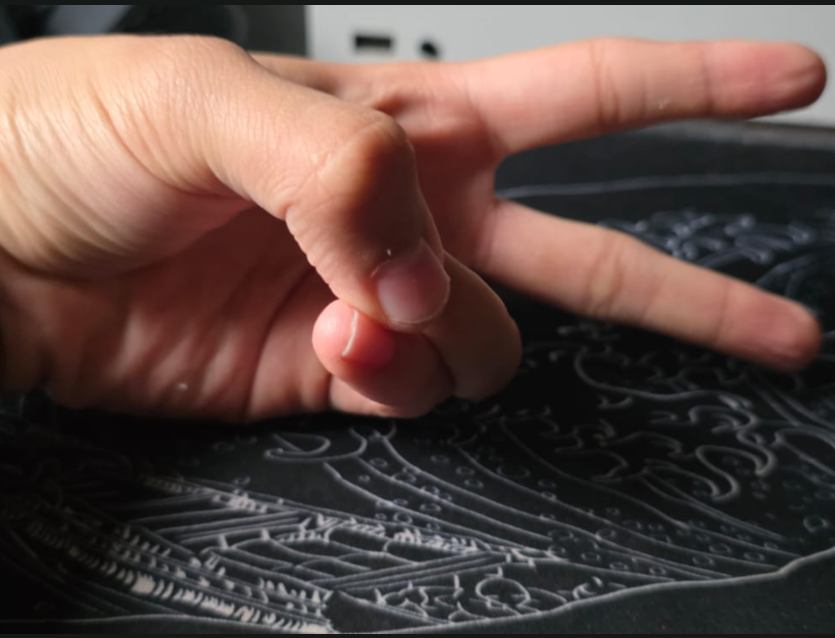
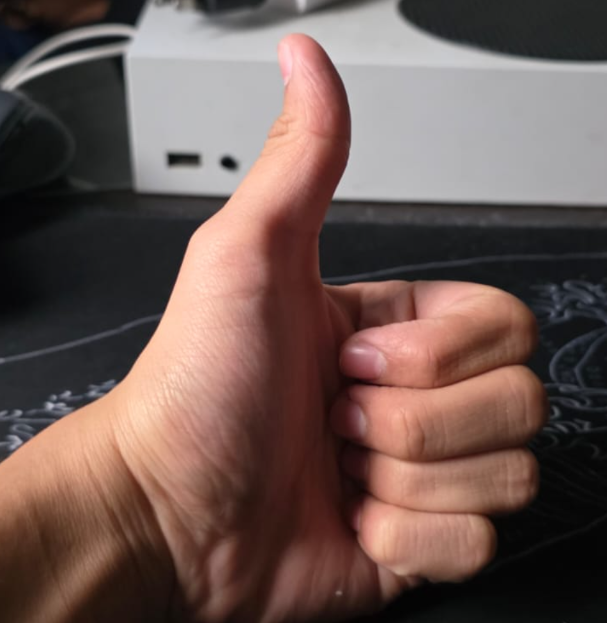

Kreslit:

Kreslit is a tool, where you literally draw whatever you want, there isn't any restrictions, so actually you can do whatever you want, also kreslit has an AI analyzer it work's when you press the button that says "AI Analyzer", or better you can user your own thumb to use this feature.

The feutures of the profect are:

- WhiteBoard: You can draw whatever you want
- Left-Hand: With this you initiate start all the commands
- Right-Hand: With this you can run the command's and also with this hand you Draw (The draw is with the index finger)
- A public website where you can try by your own way kreslit: 
- Use of
- Commands: Different comands,(all the command works only with the Left Hand, with the right you run it) this are the commands
* Change the thickness of the pencil, activate with a pinch ✊

* Activate the draw mode, it runs when you pinch your hand 🤌 with your LEFT HAND and then use the index finger in the RIGHT HAND to draw

* Activate the destroy mode, it runs when you pinch your hand 🤌 with your RIGHT HAND and then use the index finger in THE LEFT HAND to destroy 

* Color Roulette, you can change the color of the pencil with this feutures, it runs when you make the peace sign Pinky + Angular 🤙, and to pick another color you have to use your right hand and select the one 
and then make a pinch 🤌

* Undo Create what you do in the last movement, it runs when you use your Index, Middle and Angular finger 3️⃣3

* Clean whatever it's in the whiteboard, it runs when you open or your hand ✌

* AI Analyzer, it runs when your only show your thumb 👍

* Pinch, with this command you run all the commands that you start executing with the left hand 🤌

* 
* Nothing, it runs when you show your whole hand

- AI Analyzer, as you may think it's just like the name siad, Claude, Gemini or Groq the one that has free tokens will give an analysis about what you draw, also give a commentary about if he like the draw or other kind of comments
- Use of mediapie but in JS, this help's with the hand-tracking and the recognition of the gestures

Cases of use 

- When you want to draw but you want to really try something new, kreslit is available for free!, you only need a camera
- When you want to spend time with your friends seeing what the AI, think about your draws and get laugh about that one bro that the AI dind't even recognize something clear 
- When you are bored
- When you want to feel like tony stark
- When you are bored

Logic of the project since sratch

Backend: For this project i don't really use something like python, c or other programming language but i use JavaScript to manage all the information

- api/analyze.js: Is where the logic of the AI Analyzer Works, here you can see the prompt and the functions to connect with the different AI Models, also here you can adjust how does the AI is going to reply about the draws, this is made to publish the project in vercel
- server.js: Here is where you might get confused because it seems almost like the api/analyze.js file, but the principle difference is that server.js, was made to use the project locally so if you want to use it by your own way this is the file that you have to modify
- public/main.js: Here is where all the logic of the hand-tracking, hand-recognition, and all the logic behind the project make sense, here are the most important lines of the project (When i say most important is because are the one that can modify what you see in the whiteboard)
* 1-72: Here is where you intialize all the the main variables, and where you can modifiy the FPS of the project
* 79-137: Here is where 1 part of the logic of the tracking lives, because here you can modify what is going to be the fingers that have to be used to run a command, also here you initialize mediapipe
* 139-394: Here you will see the functions that are executed, when something happens, the things that happens are the commands so if you want to change the messages you can change it in this lines of code
* 396-430: Here is where you post an image of what you draw in base64 image, so the image starts being an image to then convert into a base64 JSON file; so this base64 file, is send to analyze.js, to the ai analyze it
* 431-520: Is where the project starts running locally or in a server, here you will see the start of all the page, and the definition about the need of the video image

Frontend: 
- public/index.html: Is the main html so here you will see all the static information that is shown on the window
- public/styles.css: All the design is located here
- media/all-media.png: Here it's all the media of the project

What does AI do? and what do i do:

AI: Helps me with the api/analyze.js: because when i was making all the files and when i was trying to post in the web i had a lot problems so i send it to gemini and he tells me to make a new file, also it helps me with completition of code in main.js, especificcly in the part of the things that appears in the website

ME: I make all the logic behind the project, all the connectio between the api's of the different ai-models, the design of the project, all the hand-tracking system and fix all the error that the model was giving me when it was trying to recognize the hand the OCR model , then i change it to convert the image into base64 and then send the base64 data to the ai, to then they analyze it and be posted in the whiteboard

Instructions if you want to edit the project

Hello, so first of all if you want to test the project in your own computer or maybe make changes to the code, you have to clone the repository you can clone with this command:

git clone https://github.com/JDHVa/Kreslit.git

Then when you have all the code, you have to make a new file called .env, you have to make it the brach of the project, in that file you have to put this
-gemini=Aiza.... (YOUR GEMINI API KEY Without "" only text)

-claude=sk.... (YOUR CLAUDE API KEY Without "" only text)

-groq=gsk.... (YOUR GROQ API KEY Without "" only text)

(Here is the link to have your own gemini key: https://aistudio.google.com/prompts/new_chat)

(Here is the link to have your own claude key: https://platform.claude.com/dashboard)

(Here is the link to have your own groq key: https://console.groq.com/home)

Then you have to star the project with node.js so here are the command to start it
FIRST COMMAND (it install all the dependecies of the project)

npm install  

SECOND COMMAND (it runs the project in a localhost)

npm run dev

Then enter the local host

http://localhost:3000

Then i think that it's all if you want to try it by your own way :)

